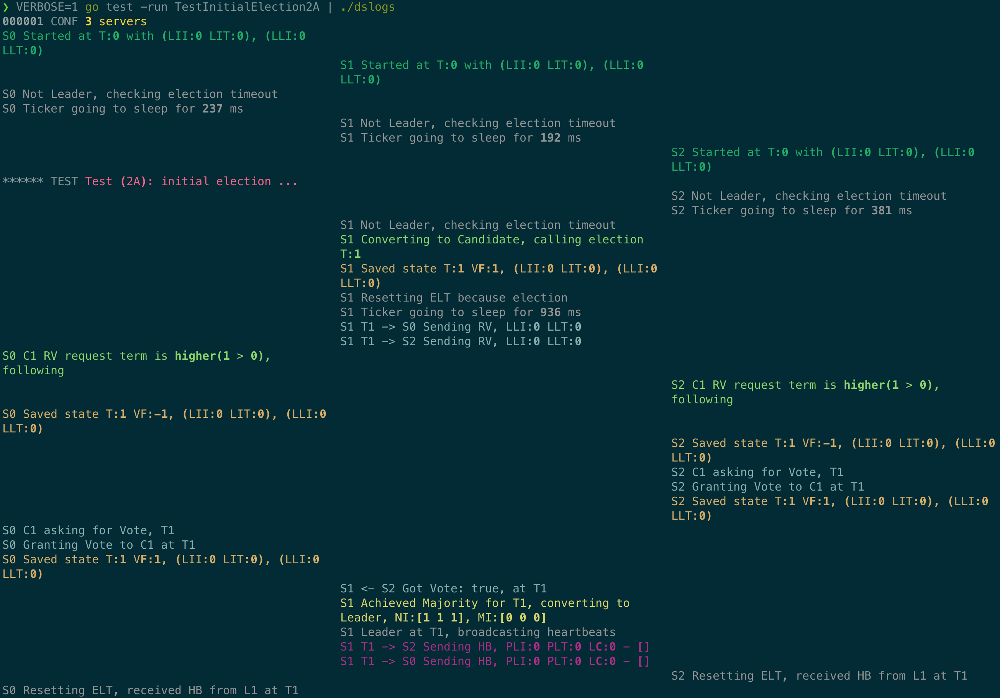
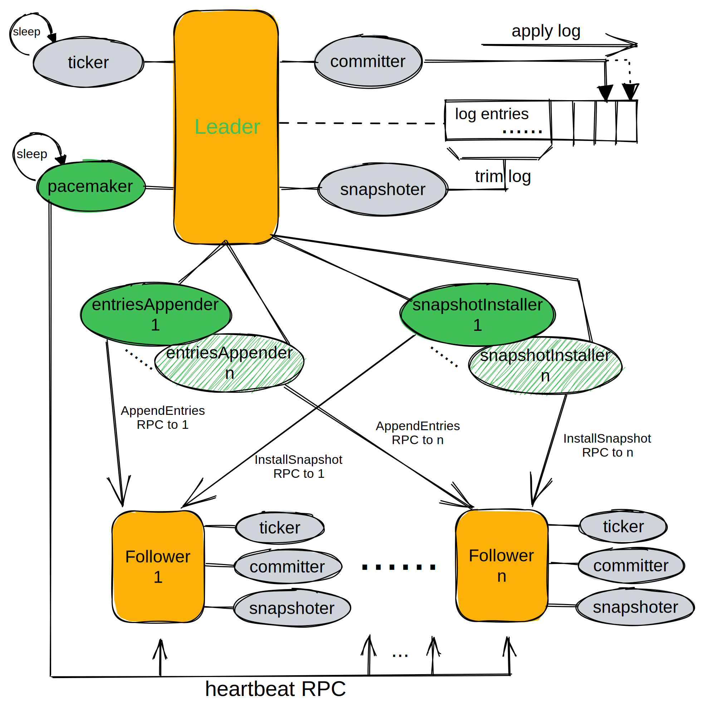
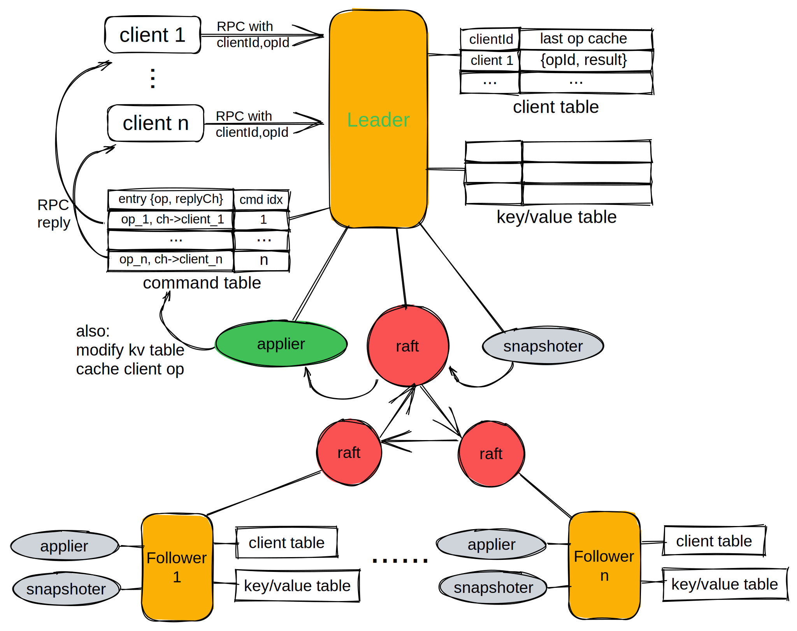
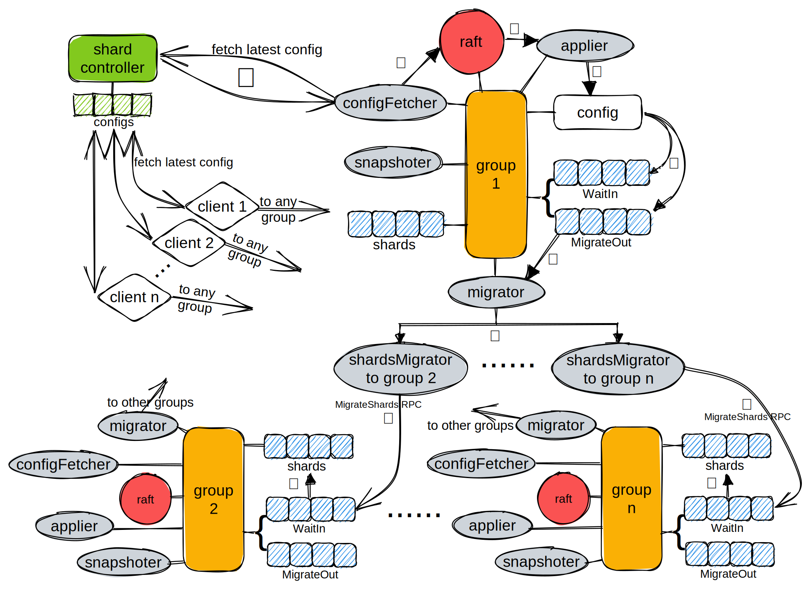

## [MIT 6.824 Distributed Systems, Spring 2022](https://pdos.csail.mit.edu/6.824/)

Raft election log

---
### Labs

> **Warning**  
> All code only for reference.  
> DO NOT copy if you are required to write your own code.

All labs' code are commented with enough details, especially Raft related labs

- [Lab1: MapReduce](https://pdos.csail.mit.edu/6.824/labs/lab-mr.html)

  ✅ [test case result](./lab-test-results/mapreduce.txt)

- [Lab2: Raft](https://pdos.csail.mit.edu/6.824/labs/lab-raft.html)

  

  
Architecture Overview

  ✅ [all test cases, one iteration](./lab-test-results/raft.txt)  
  ✅ [all test cases, thousands iterations](./lab-test-results/raft-dstest.txt)  
  ✅ [all test cases, with race detector, hundreds iterations](./lab-test-results/raft-dstest-with-race-detector.txt)  
  ✅ [2A test cases, one iteration](./lab-test-results/raft2A.txt)  
  ✅ [2A test cases, hundreds iterations](./lab-test-results/raft2A-dstest.txt)  
  ✅ [2B test cases, one iteration](./lab-test-results/raft2B.txt)  
  ✅ [2B test cases, hundreds iterations](./lab-test-results/raft2B-dstest.txt)  
  ✅ [2C test cases, one iteration](./lab-test-results/raft2C.txt)  
  ✅ [2C test cases, hundreds iterations](./lab-test-results/raft2C-dstest.txt)  
  ✅ [2D test cases, one iteration](./lab-test-results/raft2D.txt)  
  ✅ [2D test cases, hundreds iterations](./lab-test-results/raft2D-dstest.txt)  

- [Lab3: KV Raft](https://pdos.csail.mit.edu/6.824/labs/lab-kvraft.html)

  

  
Architecture Overview

  ✅ [all test cases, one iteration](./lab-test-results/kvraft.txt)  
  ✅ [all test cases, thousands iterations](./lab-test-results/kvraft-dstest.txt)  
  ✅ [all test cases, with race detector, hundreds iterations](./lab-test-results/kvraft-dstest-with-race-detector.txt)  
  ✅ [3A test cases, one iteration](./lab-test-results/kvraft3A.txt)  
  ✅ [3A test cases, hundreds iterations](./lab-test-results/kvraft3A-dstest.txt)  
  ✅ [3B test cases, one iteration](./lab-test-results/kvraft3B.txt)  
  ✅ [3B test cases, hundreds iterations](./lab-test-results/kvraft3B-dstest.txt)  

- [Lab4: Sharded KV](https://pdos.csail.mit.edu/6.824/labs/lab-shard.html)

  

  
Architecture Overview

  ✅ [4A (Shard Controller) test cases, one iteration](./lab-test-results/shard4A.txt)  
  ✅ [4A (Shard Controller) test cases, thousands iterations](./lab-test-results/shard4A-dstest.txt)  
  ✅ [4A (Shard Controller) test cases, with race detector, hundreds iterations](./lab-test-results/shard4A-dstest-with-race-detector.txt)  
  ✅ [4B (Sharded Key/Value Server) test cases, one iteration](./lab-test-results/shard4B.txt)  
  ✅ [4B (Sharded Key/Value Server) test cases, thousands iteration](./lab-test-results/shard4B-dstest.txt)  
  ✅ [4B (Sharded Key/Value Server) test cases, with race detector, hundreds iteration](./lab-test-results/shard4B-dstest-with-race-detector.txt)  
  ✅ [4B Challenge test cases, one iteration](./lab-test-results/shard4B-challenge.txt)  
  ✅ [4B Challenge test cases, thousands iteration](./lab-test-results/shard4B-challenge-dstest.txt)  
  ✅ [4B Challenge test cases, with race detector, hundreds iteration](./lab-test-results/shard4B-challenge-dstest-with-race-detector.txt)  

### Progress

- [x] LEC 1: [Introduction](https://pdos.csail.mit.edu/6.824/notes/l01.txt), [video](https://youtu.be/WtZ7pcRSkOA) 
  - [x] Preparation: Read [MapReduce (2004)](https://pdos.csail.mit.edu/6.824/papers/mapreduce.pdf) 

- [x] LEC 2: [RPC and Threads](https://pdos.csail.mit.edu/6.824/notes/l-rpc.txt), [crawler.go](https://pdos.csail.mit.edu/6.824/notes/crawler.go), [kv.go](https://pdos.csail.mit.edu/6.824/notes/kv.go), [vote examples](https://pdos.csail.mit.edu/6.824/notes/condvar.tar.gz), [video](https://youtu.be/oZR76REwSyA) 
  - [x] Preparation: Do [Online Go tutorial](http://tour.golang.org/) ([FAQ](https://pdos.csail.mit.edu/6.824/papers/tour-faq.txt)) ([Question](https://pdos.csail.mit.edu/6.824/questions.html?q=q-gointro&lec=2))

- [x] LEC 3: [GFS](https://pdos.csail.mit.edu/6.824/notes/l-gfs.txt), [video](https://youtu.be/6ETFk1-53qU) 
  - [x] Preparation: Read [GFS (2003)](https://pdos.csail.mit.edu/6.824/papers/gfs.pdf) ([FAQ](https://pdos.csail.mit.edu/6.824/papers/gfs-faq.txt)) ([Question](https://pdos.csail.mit.edu/6.824/questions.html?q=q-gfs&lec=3)) 

- [x] LEC 4: [Primary-Backup Replication](https://pdos.csail.mit.edu/6.824/notes/l-vm-ft.txt), [video](https://youtu.be/gXiDmq1zDq4) 
  - [x] Preparation: Read [Fault-Tolerant Virtual Machines (2010)](https://pdos.csail.mit.edu/6.824/papers/vm-ft.pdf) ([FAQ](https://pdos.csail.mit.edu/6.824/papers/vm-ft-faq.txt)) ([Question](https://pdos.csail.mit.edu/6.824/questions.html?q=q-vm-ft&lec=4))

- [x] LEC 5: [Fault Tolerance: Raft (1)](https://pdos.csail.mit.edu/6.824/notes/l-raft.txt), [video](https://youtu.be/R2-9bsKmEbo) 
  - [x] Preparation: Read [Raft (extended) (2014), to end of Section 5](https://pdos.csail.mit.edu/6.824/papers/raft-extended.pdf) ([FAQ](https://pdos.csail.mit.edu/6.824/papers/raft-faq.txt)) ([Question](https://pdos.csail.mit.edu/6.824/questions.html?q=q-raft&lec=5))

- [x] LEC 6: [Debugging](https://pdos.csail.mit.edu/6.824/notes/debugging.pdf) 
  - [x] Preparation: Read [Debugging by Pretty Printing](https://blog.josejg.com/debugging-pretty/) ([Question](https://pdos.csail.mit.edu/6.824/questions.html?q=q-debug&lec=6))

- [x] LEC 7: [Fault Tolerance: Raft (2)](https://pdos.csail.mit.edu/6.824/notes/l-raft2.txt), [video](https://youtu.be/h3JiQ_lnkE8) 
  - [x] Preparation: Read [Raft (extended) (2014), Section 7 to end (but not Section 6)](https://pdos.csail.mit.edu/6.824/papers/raft-extended.pdf) ([FAQ](https://pdos.csail.mit.edu/6.824/papers/raft2-faq.txt)) ([Question](https://pdos.csail.mit.edu/6.824/questions.html?q=q-raft2&lec=7)) 

- [x] LEC 8: Q&A Lab2 A+B 
  - [x] Preparation: ([Question](https://pdos.csail.mit.edu/6.824/questions.html?q=q-QAlab&lec=8))

- [x] LEC 9: [Zookeeper](https://pdos.csail.mit.edu/6.824/notes/l-zookeeper.txt), [video](https://youtu.be/HYTDDLo2vSE) 
  - [x] Preparation: Read [ZooKeeper (2010)](https://pdos.csail.mit.edu/6.824/papers/zookeeper.pdf) ([FAQ](https://pdos.csail.mit.edu/6.824/papers/zookeeper-faq.txt)) ([Question](https://pdos.csail.mit.edu/6.824/questions.html?q=q-zookeeper&lec=9)) 

- [x] LEC 10: [Chain Replication](https://pdos.csail.mit.edu/6.824/notes/l-cr.txt), [video](https://youtu.be/1uUcW-Mqg5o) 
  - [x] Preparation: Read [CR (2004)](https://pdos.csail.mit.edu/6.824/papers/cr-osdi04.pdf) ([Question](https://pdos.csail.mit.edu/6.824/questions.html?q=q-cr&lec=10))

- [x] LEC 11: [Distributed Transactions](https://pdos.csail.mit.edu/6.824/notes/l-2pc.txt), [video](https://youtu.be/B6btpukqHpM) 
  - [x] Preparation: Read [6.033 Chapter 9](https://ocw.mit.edu/resources/res-6-004-principles-of-computer-system-design-an-introduction-spring-2009/online-textbook/), just 9.1.5, 9.1.6, 9.5.2, 9.5.3, 9.6.3 ([FAQ](https://pdos.csail.mit.edu/6.824/papers/chapter9-faq.txt)) ([Question](https://pdos.csail.mit.edu/6.824/questions.html?q=q-chapter9&lec=11))

- [x] LEC 12: [Cache Consistency: Frangipani](https://pdos.csail.mit.edu/6.824/notes/l-frangipani.txt), [video](https://youtu.be/jPrUxfIcWWs) 
  - [x] Preparation: Read [Frangipani](https://pdos.csail.mit.edu/6.824/papers/thekkath-frangipani.pdf) ([FAQ](https://pdos.csail.mit.edu/6.824/papers/frangipani-faq.txt)) ([Question](https://pdos.csail.mit.edu/6.824/questions.html?q=q-frangipani&lec=12)) 

- [x] LEC 13: [Spanner](https://pdos.csail.mit.edu/6.824/notes/l-spanner.txt), [video](https://youtu.be/ZulDvY429B8) 
  - [x] Preparation: Read [Spanner (2012)](https://pdos.csail.mit.edu/6.824/papers/spanner.pdf) ([FAQ](https://pdos.csail.mit.edu/6.824/papers/spanner-faq.txt)) ([Question](https://pdos.csail.mit.edu/6.824/questions.html?q=q-spanner&lec=13))

- [x] LEC 14: [Optimistic Concurrency Control](https://pdos.csail.mit.edu/6.824/notes/l-farm.txt), [video](https://youtu.be/07xsfL5E8Ck), [video cont.](https://youtu.be/XwU4jKhBxws) 
  - [x] Preparation: Read [FaRM (2015)](https://pdos.csail.mit.edu/6.824/papers/farm-2015.pdf) ([FAQ](https://pdos.csail.mit.edu/6.824/papers/farm-faq.txt)) ([Question](https://pdos.csail.mit.edu/6.824/questions.html?q=q-farm&lec=14))

- [x] LEC 15: [Big Data: Spark](https://pdos.csail.mit.edu/6.824/notes/l-spark.txt), [video](https://youtu.be/qXb5rDGqFdc) 
  - [x] Preparation: Read [Spark (2012)](https://pdos.csail.mit.edu/6.824/papers/zaharia-spark.pdf) ([FAQ](https://pdos.csail.mit.edu/6.824/papers/spark-faq.txt)) ([Question](https://pdos.csail.mit.edu/6.824/questions.html?q=q-spark&lec=15))

- [x] LEC 16: [Cache Consistency: Memcached at Facebook](https://pdos.csail.mit.edu/6.824/notes/l-memcached.txt), [video](https://youtu.be/eYZg0YJtFEE) 
  - [x] Preparation: Read [Memcached at Facebook (2013)](https://pdos.csail.mit.edu/6.824/papers/memcache-fb.pdf) ([FAQ](https://pdos.csail.mit.edu/6.824/papers/memcache-faq.txt)) ([Question](https://pdos.csail.mit.edu/6.824/questions.html?q=q-memcached&lec=16))

- [x] LEC 17: [Causal Consistency, COPS](https://pdos.csail.mit.edu/6.824/notes/l-cops.txt), [video](https://youtu.be/fR_NB714EAI) 
  - [x] Preparation: Read [COPS (2011)](https://pdos.csail.mit.edu/6.824/papers/cops.pdf) ([Question](https://pdos.csail.mit.edu/6.824/questions.html?q=q-cops&lec=17))

- [x] LEC 18: [Fork Consistency, SUNDR](https://pdos.csail.mit.edu/6.824/notes/l-sundr.txt), [video](https://youtu.be/FxwjSs_xSBM) 
  - [x] Preparation: Read [SUNDR (2004)](https://pdos.csail.mit.edu/6.824/papers/li-sundr.pdf) (until Section 3.4) ([FAQ](https://pdos.csail.mit.edu/6.824/papers/sundr-faq.txt)) ([Question](https://pdos.csail.mit.edu/6.824/questions.html?q=q-sundr&lec=18))

- [x] LEC 19: Peer-to-peer: [Bitcoin](https://pdos.csail.mit.edu/6.824/notes/l-bitcoin.txt), [video](https://youtu.be/yB6m8EjAqPU) 
  - [x] Preparation: Read [Bitcoin (2008)](https://pdos.csail.mit.edu/6.824/papers/bitcoin.pdf), and [summary](http://www.michaelnielsen.org/ddi/how-the-bitcoin-protocol-actually-works) ([FAQ](https://pdos.csail.mit.edu/6.824/papers/bitcoin-faq.txt)) ([Question](https://pdos.csail.mit.edu/6.824/questions.html?q=q-bitcoin&lec=19))

- [x] LEC 20: [Blockstack](https://pdos.csail.mit.edu/6.824/notes/l-blockstack.txt), [video](https://youtu.be/DnyBPxo3B6I) 
  - [x] Preparation: Read [BlockStack (2016)](https://pdos.csail.mit.edu/6.824/papers/blockstack-atc16.pdf) ([FAQ](https://pdos.csail.mit.edu/6.824/papers/blockstack-faq.txt)) ([Question](https://pdos.csail.mit.edu/6.824/questions.html?q=q-blockstack&lec=20))

- [x] LEC 21: [Smart Contracts](https://pdos.csail.mit.edu/6.824/notes/l-ethereum.txt), [Billboard.sol](https://pdos.csail.mit.edu/6.824/notes/Billboard.sol), [Casino.sol](https://pdos.csail.mit.edu/6.824/notes/Casino.sol) 
  - [x] Preparation: Read [Ethereum White Paper (2014)](https://ethereum.org/en/whitepaper/) ([Question](https://pdos.csail.mit.edu/6.824/questions.html?q=q-ethereum&lec=21))

- [x] LEC 22: Project demos, [video](https://youtu.be/bu41Qt9G5Qo) 
